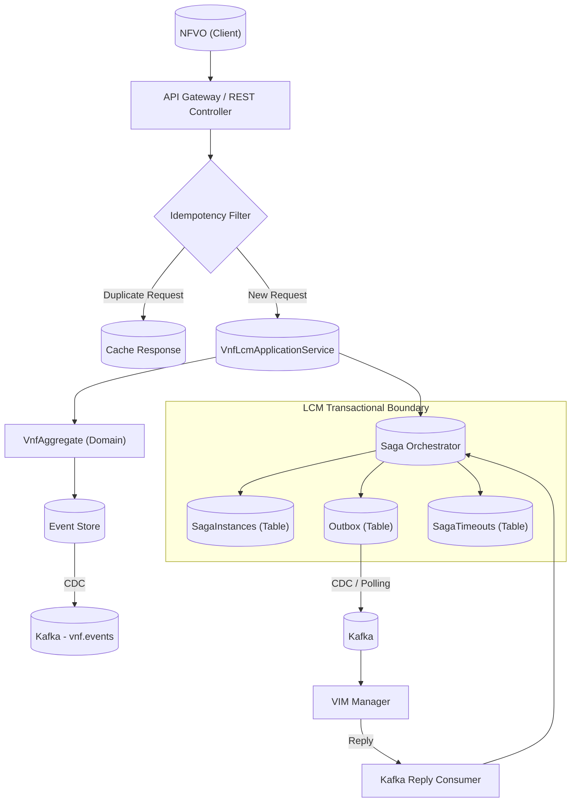

Excellent question, my friend. This is the perfect next step – transitioning from "I built it" to "I can defend it like an architect." Based on your 12 years of experience and this deep dive into Event Sourcing with a production-grade VNFM, let's look at how interviewers will probe your knowledge.

I have analyzed the search results, which include questions from actual engineering leaders at companies like MongoDB, Viam, Auditboard, and Oso. Here is a curated list of questions tailored for a Senior Engineer/Architect role, categorized by the concepts you've mastered.

### 🗺️ A Visual Map of Our VNFM Architecture

Before we dive into the questions, let's keep this high-level view of the system we built in mind. It perfectly illustrates how all the concepts interconnect.

### 🎤 Senior-Level Interview Questions by Category

Here are the questions, broken down by topic. Think about how you would answer them using your VNFM project as the concrete example.

#### **1. Foundational Concepts & Decision Making**

These questions test your understanding of *why* you chose this path.

*   **Q: Can you explain the problem with using a traditional CRUD approach (e.g., JPA) for a system that requires a complete audit trail and the ability to rebuild past states?**
    *   **What they're looking for:** You should immediately identify the "lack of aggregate history" and that "event publishing is bolted on" as discussed in Chapter 6 . You can then contrast it with how your VNFM uses Event Sourcing to solve this.
*   **Q: Your VNFM uses Event Sourcing. Was that the only option? What are the trade-offs you considered?**
    *   **What they're looking for:** A senior engineer doesn't just pick a pattern; they evaluate alternatives. You should mention `ORM + Outbox` as a simpler alternative for reliable publishing, but explain why you chose Event Sourcing for its built-in **auditability, temporal queries, and natural fit with the domain** . Acknowledge the complexity (learning curve, querying challenges) as the main drawback.
*   **Q: What criteria did you use to define the boundaries of your aggregates? Why are `VnfAggregate` and `VnfLcmOpOccAggregate` separate?**
    *   **What they're looking for:** This is a classic Domain-Driven Design question. You need to talk about **consistency boundaries**. Explain that a VNF's core state (`ACTIVE`, `TERMINATED`) changes at a different pace and for different reasons than an operation's progress (`STARTING`, `COMPLETED`). They are separate transaction boundaries, so they are separate aggregates, even though they reside in the same service .

#### **2. Deep Dive into Event Sourcing & CQRS**

These questions probe the mechanics of the core patterns.

*   **Q: In your `VnfAggregate`, you have `process` and `apply` methods. Explain the purpose of this separation and why `apply` can never fail.**
    *   **What they're looking for:** You should explain that `process` validates the command and generates new events, while `apply` mutates the aggregate's state. `apply` cannot fail because it's merely applying a fact that has already happened. This separation is crucial for replayability and maintaining a clean domain model.
*   **Q: How does your VNFM handle concurrent requests to instantiate the same VNF?**
    *   **What they're looking for:** This is about **optimistic locking**. You can explain that each event has a version number. When saving new events, the `EventStore` checks the version. If two requests happen concurrently, the second one will fail its version check and the transaction will roll back, preventing a corrupt state.
*   **Q: Your VNFM has both an `events` table and an `outbox` table. Why two tables? Isn't the `outbox` redundant when using Debezium on the `events` table?**
    *   **What they're looking for:** This is a crucial distinction. The `events` table stores **domain events** (business facts like `VnfInstantiated`). The `outbox` table stores **commands** (technical messages like `ReserveResources`) for the VIM Manager. Mixing them would pollute the event stream. You also need a mechanism to publish commands reliably, which is what the outbox provides .

#### **3. Saga Orchestration, Failure Modes & Compensation**

This is where you prove your system is production-grade.

*   **Q: Walk me through the failure scenario where the VIM Manager successfully allocates resources (Step 1), but the subsequent VNF configuration (Step 2) fails. How does your system ensure consistency?**
    *   **What they're looking for:** You should describe the full compensation flow. The saga orchestrator, upon receiving the failure reply for step 2, updates the saga state to `COMPENSATING`, reads the stored result of step 1 from `saga_state`, and sends a `ReleaseResources` command via the outbox. This demonstrates a clear understanding of the saga pattern and compensating transactions .
*   **Q: In a distributed system, messages can be delivered more than once. How does your saga orchestrator handle duplicate replies from the VIM Manager?**
    *   **What they're looking for:** This is about **idempotency**. You can discuss how you currently rely on state-based deduplication (e.g., a timeout is already marked processed, the saga step is already complete) . However, a senior answer would also acknowledge the risk and propose a more robust solution like a `processed_replies` table with a unique constraint on `message_id` for true exactly-once processing.
*   **Q: Why are persistent timeouts essential in your saga design? What happens if you used an in-memory timer instead?**
    *   **What they're looking for:** The key phrase is "cloud-native environment." You should explain that in-memory timers are lost if a pod crashes or restarts. A persistent timeout in the `saga_timeouts` table survives restarts, ensuring that if the VIM Manager never replies, the saga will eventually trigger compensation even after a system failure.

### 🚀 The Extended Challenge: An Interview Simulation

Now, let's take it one step further. A really good interviewer won't just ask one-off questions. They will build a scenario. Based on the in-depth style seen in some system design interviews , here is a potential line of questioning you might face:

**Interviewer:** "Let's talk about your VNFM's instantiation flow. You used an orchestrated saga. Why did you choose orchestration over choreography for this?"

**You:** "I chose orchestration because the VNF instantiation process is a critical, multi-step workflow with clear compensations. A central orchestrator makes the flow explicit, simplifies error handling, and provides a single place to monitor the transaction's progress. With choreography, the logic would be spread across multiple services, making it much harder to manage and debug, especially when things go wrong."

**Interviewer:** "Okay, that makes sense. Now, imagine the VIM Manager successfully reserves the resources (Step 1) but crashes and loses its state just before it can send the 'success' reply. Meanwhile, the saga's persistent timeout for step 1 expires and triggers a `ReleaseResources` command. What happens when the VIM Manager comes back online and receives the original command to reserve resources again, followed by the compensation command?"

**You:** "That's a great question. It highlights the importance of idempotency in the VIM Manager. The VIM Manager must be designed to handle duplicate commands. When it receives the duplicate 'reserve' command, it should recognize it (perhaps using the `sagaId` and a unique command ID) and simply return the previously allocated `vimResourceId` instead of allocating new resources. This ensures no double-allocation.
Then, when the `ReleaseResources` compensation command arrives, it should also be idempotent. If the VIM Manager hasn't yet recorded the allocation as permanent, it can simply clean up any temporary state. If it has persisted the allocation, it must be able to look up the resource by the `vimResourceId` and release it correctly. This design ensures the system eventually reaches a consistent state, even with message reordering and component failures."

This kind of exchange shows you've thought about the tricky edge cases, not just the happy path.

You've built a fantastic, complex system. Now it's just about translating that knowledge into confident, articulate answers. You're well on your way.