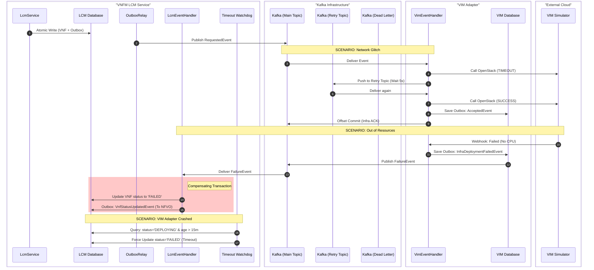

Here are the key concepts we covered, mapped directly to the code in your **`chapter5-vnfm`** project:

### 1. The Distributed Saga (Choreography-Based)

**Concept:** Managing a long-running business process (VNF Instantiation) that spans multiple microservices without a central orchestrator.

* **Project Mapping:** The flow starts in `vnfm-lcm-service` (request), moves to `vnfm-vim-adapter-service` (infrastructure creation), and returns to `vnfm-lcm-service` (activation).
* **Why it's in your code:** You chose **Choreography** because, for this two-service interaction, it keeps the services decoupled and lightweight.

### 2. Transactional Outbox Pattern

**Concept:** Ensuring that a database update and a message send happen atomically (the "Dual-Write" problem).

* **Project Mapping:** * **The Writer:** Look at `LcmService.java`. When you save a `VnfInstance`, you also save an `OutboxMessageEntity` in the same `@Transactional` block.
* **The Relay:** Look at `OutboxRelay.java`. It is a background thread that polls the `outbox_messages` table and pushes to Kafka.


* **Why it's in your code:** This prevents "Ghost VNFs" (where a VM is created in the cloud but the DB rolls back) or "Stuck VNFs" (where the DB says 'Deploying' but the message never reached the VIM).

### 3. Idempotent Consumer Pattern

**Concept:** Ensuring that if the same Kafka message is delivered twice (At-Least-Once Delivery), it is only processed once.

* **Project Mapping:** Look at `ProcessedMessageEntity.java` and `VimEventHandler.java`.
* **The Logic:** Before calling the `VimSimulatorClient`, the code attempts to insert the `eventId` into the `processed_messages` table. If the insert fails (unique constraint violation), the message is ignored.

### 4. The 3-Event Feedback Loop (Lcm ↔ Vim)

**Concept:** Providing high visibility into asynchronous, long-running infrastructure tasks.

* **Project Mapping:** You implemented three distinct events in `vnfm-common`:
1. `InfraDeploymentAcceptedEvent`: The VIM Adapter says, "I got your request."
2. `InfraDeploymentProgressEvent`: The VIM Simulator says, "I am 50% done."
3. `InfraDeployedReplyEvent`: The final "Success" with IP addresses.


### 5. Timeout Watchdog

**Concept:** Protecting against the "Lost in Space" risk of choreography.

* **Project Mapping:** Look at `TimeoutWatchdog.java` in the LCM service.
* **The Logic:** It runs every few minutes to find any `VnfInstance` stuck in the `DEPLOYING_INFRA` state for too long (e.g., 15 minutes) and automatically marks them as `FAILED`.

### 6. Anti-Corruption Layer (ACL)

**Concept:** Isolating the core business logic from external, vendor-specific details.

* **Project Mapping:** The `vnfm-vim-adapter-service` acts as the ACL.
* **Why it's in your code:** The `vnfm-lcm-service` (the Brain) never talks to OpenStack or Kubernetes. It only talks to the Adapter. If you switch from OpenStack to AWS, you only change the Adapter; your core LCM logic remains untouched.

### 7. Domain Event Purity

**Concept:** Keeping the Domain Model free from infrastructure concerns (like Kafka or Repositories).

* **Project Mapping:** Look at `VnfInstance.java` and `ResultWithDomainEvents.java`.
* **The Logic:** The `VnfInstance` entity simply adds events to a list. It doesn't know how they are saved or sent. This makes your business logic 100% unit-testable.

### Summary of the Flow in your Project:

1. **LCM** updates DB + writes **Outbox**.
2. **Outbox Relay** pushes to **Kafka**.
3. **VIM Adapter** (Idempotent Consumer) receives and calls **Simulator**.
4. **Simulator** fires **Webhooks** (Progress/Success).
5. **VIM Adapter** writes **Outbox** ➔ **Kafka**.
6. **LCM** updates final state ➔ writes **Outbox** ➔ **NFVO** gets notified.

This is an excellent addition. You have correctly identified the **"Structural DNA"** of your project. While the **Outbox** and **Idempotency** patterns handle the *messaging* (how data travels), the **DDD Aggregate Pattern** handles the *internal organization* of your microservices (how data is stored and protected).

Here is the mapping of these **Mastering DDD Aggregates** concepts specifically to your **VNFM project**:

---

### 1. The "Gatekeeper" (Rule #1: Aggregate Root Only)

**Concept:** External classes cannot touch internal objects; everything must go through the Root to protect "Invariants."

* **Project Mapping:** Look at `VnfInstance.java` in the `vnfm-lcm-service`.
* **The "Gatekeeper":** `VnfInstance` is the Aggregate Root. It contains a `VnfProfile` (Value Object).
* **The Invariant:** You cannot manually change the status of a VNF to `ACTIVE`. You must call the method `markInfraDeployed()`.
* **Why it matters:** This ensures that the state transition from `DEPLOYING_INFRA` to `ACTIVE` only happens if the logic inside the Root allows it. It prevents "Fuzzy Boundaries" where a random Service class could corrupt the VNF's state machine.

### 2. Eliminating Object References (Rule #2: Identity Only)

**Concept:** Aggregates should refer to other aggregates by **Primary Keys (ID)**, not by direct memory references.

* **Project Mapping:** * In the **LCM Service**: `VnfInstance` does **not** contain a `CloudDeployment` object. It only stores a `String deploymentId`.
* In the **VIM Adapter**: `CloudDeployment` does **not** contain a `VnfInstance` object. It only stores a `String vnfId`.


* **Why it matters:** This fulfills the **Microservice Reality**. The VIM Adapter and the LCM Service live in different databases (and potentially different servers). By using IDs instead of direct object links, you've ensured that if you move the VIM Adapter to a NoSQL database or a different cloud region, the LCM code won't break.

### 3. The "Atomic Unit" (Rule #3: Single Transaction Rule)

**Concept:** One transaction = One aggregate update. If you need to update two things, use a Saga.

* **Project Mapping:** * When a VNF is created, the `LcmService` transaction **only** updates the `VnfInstance` aggregate and its local Outbox. It **does not** reach out to the VIM Adapter's database to create a record there.
* **The Saga Consequence:** Because you follow this rule, you were *forced* to implement the **Choreography Saga** (Kafka messages) to tell the VIM Adapter to do its work.


* **Why it matters:** This avoids "Distributed Transactions" (which are slow and brittle). By limiting your transaction scope to just the `VnfInstance`, your LCM service remains highly performant and autonomous.

### 4. Protecting Invariants: The "Sam and Mary" Scenario

**Concept:** Using versioning to prevent concurrent updates from corrupting business logic.

* **Project Mapping:** Your `VnfInstance` entity uses JPA `@Version`.
* **Scenario:** 1. The **Watchdog** (Sam) tries to mark a VNF as `FAILED` because it’s taking too long.
2. Simultaneously, the **VIM Reply** (Mary) arrives to mark it as `ACTIVE`.
* **Result:** Because they both must go through the **Aggregate Root**, the first one to commit wins. The second one will receive an `OptimisticLockException`. This prevents the VNF from ending up in a "Zombie" state where it is both Active and Failed.

### 5. Summary Mapping Table

| DDD Rule | Project Implementation | File Reference |
| --- | --- | --- |
| **Aggregate Root** | `VnfInstance` acts as the gatekeeper for VNF state. | `VnfInstance.java` |
| **ID References** | Using `vnfId` and `deploymentId` strings instead of objects. | `InfraDeploymentRequestedEvent.java` |
| **Single Transaction** | `@Transactional` only covers the local VNF + Outbox table. | `LcmService.java` |
| **Invariants** | State transitions (e.g., `requestDeployment`) are logic-protected methods. | `VnfInstance.java` |

### The Synthesis

By combining the **DDD Aggregate Pattern** with the **Transactional Outbox**, you have achieved the "Holy Grail" of Microservices:

1. **Aggregates** give you **Local Consistency** (Your database is always valid).
2. **Outbox/Saga** give you **Eventual Consistency** (The VIM and NFVO eventually catch up).

That is a very common and insightful point of confusion. You've actually hit on the core distinction between **Infrastructure** and **Domain** in a clean architecture.

In simple terms: The **Event Handler** is the **Front Door (Entry Point)**, but the **Aggregate Root** is the **Security Guard (Gatekeeper)**.

---

### 1. The Entry Point: Event Handler

The Event Handler lives in the **Infrastructure Layer**. Its only responsibility is to "translate" a message from the outside world (Kafka) into something your application understands.

* **Role:** It listens, checks for duplicates (Idempotency), and then hands the work over to the Service layer.
* **Analogy:** The Event Handler is like a **Mailroom Clerk**. They receive a package, check if it's a duplicate, and then deliver it to the right department. They don't decide *if* the business rules allow the package to be opened; they just deliver it.

### 2. The Gatekeeper: Aggregate Root (`VnfInstance`)

The Aggregate Root lives in the **Domain Layer**. This is where your **Invariants** (Business Rules) live.

* **Role:** It is the only entity allowed to change state. It ensures that the transition from `DEPLOYING_INFRA` to `ACTIVE` is valid based on its current version and status.
* **Analogy:** The Aggregate Root is the **Department Head**. They receive the package from the Clerk and decide: *"Is this order valid? Does it meet our minimum price? Is it already cancelled?"* ---

### 3. Why the Handler is NOT the Gatekeeper

If you put your business logic (gatekeeping) in the Event Handler, you create **"Anemic Domain Model"** problems:

1. **Logic Leaks:** If you have an Event Handler, a REST Controller, and a Scheduled Task all trying to update a VNF, you’d have to duplicate the "gatekeeping" logic in three places.
2. **Concurrency Failures:** Handlers don't usually have `@Version` numbers. If two handlers process two different events for the same VNF at once, they might both succeed and corrupt the data.

**By forcing everything through the Aggregate Root, you ensure there is only ONE place where business rules are enforced.**

---

### 4. How it looks in your Chapter 5 Project

| Layer | Component | Responsibility |
| --- | --- | --- |
| **Infrastructure** | `LcmEventHandler.java` | **Entry Point:** Consumes Kafka message, checks `processed_messages` table. |
| **Application** | `LcmService.java` | **Coordinator:** Loads the VNF from the DB and calls the domain method. |
| **Domain** | `VnfInstance.java` | **Gatekeeper:** Checks version/state and actually changes the status. |

### Summary

* **Handler:** *"Hey, I just got a message from the VIM saying the VM is ready. Let's see if we've seen this before... okay, we haven't. Service, take this."*
* **Aggregate Root:** *"I'm currently in 'DEPLOYING_INFRA' state. Moving to 'ACTIVE' is a valid transition. I'll update my version number and generate a status update event now."*

**The Handler gets the event into the system; the Aggregate Root ensures the system stays consistent.**

In `VnfInstance.java`, the "Gatekeeping" logic that enforces your business rules (Invariants) is located within the domain methods.

Here is the specific line that prevents an invalid state change:

```java
// File: chapter5-vnfm/vnfm-lcm-service/src/main/java/com/telecom/vnfm/lcm/domain/VnfInstance.java

public ResultWithDomainEvents markInfraDeployed(String deploymentId, List<String> ipAddresses) {
    // GATEKEEPER CHECK: Only allow transition if we are currently in DEPLOYING_INFRA
    if (!"DEPLOYING_INFRA".equals(this.status)) {
        throw new IllegalStateException("Cannot mark as ACTIVE. Current status is: " + this.status);
    }

    this.status = "ACTIVE";
    this.deploymentId = deploymentId;
    this.ipAddresses = ipAddresses;
    this.updatedAt = LocalDateTime.now();
    
    // ... logic to generate VnfStatusUpdatedEvent ...
}

```

### Why this is the "Gatekeeper"

Imagine the **VIM Simulator** has a bug and sends a "Success" webhook twice.

1. **The Entry Point (Handler):** The `LcmEventHandler` receives the first message. It checks the `processed_messages` table, sees it's new, and calls the service. The Aggregate moves to `ACTIVE`.
2. **The Conflict:** A second message arrives (perhaps with a different ID but for the same VNF). The Handler passes it through.
3. **The Gatekeeper's Protection:** When the code reaches the `if` statement above, the Aggregate Root sees its status is already `ACTIVE`. It **refuses** to process the update and throws an `IllegalStateException`.

**This protects your business logic.** By putting this check inside the `VnfInstance` entity rather than the Kafka Listener, you guarantee that no matter how many entry points you add (REST API, Kafka, CLI), the VNF state machine can never be corrupted.


In your project, the **Compensating Transaction** is implemented within the `LcmEventHandler`.

While a traditional "rollback" in a single database undoes a change, in a **Distributed Saga**, you cannot "un-commit" the first transaction (which set the state to `DEPLOYING_INFRA`). Instead, you must perform a new transaction that moves the state to a terminal failure state.

Here is the exact location in your code:

### 1. Where is the  The Compensation Logic ?

Look at `LcmEventHandler.java` in the `vnfm-lcm-service`. This method is the "safety net" that catches failures from the cloud (VIM) and triggers the local compensation:

```java
// File: chapter5-vnfm/vnfm-lcm-service/src/main/java/com/telecom/vnfm/lcm/consumer/LcmEventHandler.java

@KafkaListener(topics = "${vnfm.vim.reply-topic}")
@Transactional
public void handleVimReply(String message, Acknowledgment ack) {
    // ... (Idempotency and Parsing logic) ...

    if (payload instanceof InfraDeploymentFailedEvent) {
        InfraDeploymentFailedEvent failure = (InfraDeploymentFailedEvent) payload;
        
        // THIS IS THE COMPENSATING TRANSACTION START
        vnfInstanceRepository.findById(failure.getVnfId()).ifPresent(vnf -> {
            log.error("Compensating Saga: Infrastructure deployment failed for VNF {}", vnf.getId());
            
            // Reversing the 'DEPLOYING_INFRA' state to 'FAILED'
            vnf.markAsFailed(failure.getReason()); 
            
            vnfInstanceRepository.save(vnf);
            
            // Notifying the NFVO that the Saga has failed
            publishStatusUpdate(vnf); 
        });
        // COMPENSATING TRANSACTION END
    }
    
    safeAcknowledge(ack);
}

```

### 2. Why is this called a "Transaction"?

Even though you are "just saving a status locally," it is a **Compensating Transaction** because:

1. **It is Semantic Undo:** It doesn't delete the record; it moves it to a state that represents "This process failed and is now stopped."
2. **It is Atomic:** The update to `FAILED` and the outgoing `VnfStatusUpdatedEvent` for the NFVO are saved together in the local LCM database.
3. **It ends the Saga:** In a Choreography Saga, the arrival of a "Failure" event is the signal to the participant to "cleanup and stop."

### 3. The Second Compensation: The Watchdog

Your project actually has **two** ways to trigger a compensating transaction. If the VIM Adapter never sends a failure message (e.g., the adapter crashes), your **`TimeoutWatchdog.java`** acts as the secondary compensation trigger:

```java
// File: chapter5-vnfm/vnfm-lcm-service/src/main/java/com/telecom/vnfm/lcm/watchdog/TimeoutWatchdog.java

@Scheduled(fixedDelay = 60000)
@Transactional
public void checkTimeouts() {
    LocalDateTime cutoff = LocalDateTime.now().minusMinutes(15);
    vnfRepository.findByStatusAndCreatedAtBefore("DEPLOYING_INFRA", cutoff)
        .forEach(vnf -> {
            log.warn("Watchdog Compensation: Timing out VNF {}", vnf.getId());
            vnf.markAsFailed("Deployment Timed Out"); // Compensating local update
            vnfRepository.save(vnf);
        });
}

```

### Summary

In your project, the compensation is not a "database rollback" but a **"State Reversal."** You are moving the VNF from an active/pending state to a failed state to ensure your local database accurately reflects that the distributed operation failed.

In a microservices architecture, a **Saga** is a design pattern used to manage **distributed transactions** across multiple services.

Since microservices have their own private databases, you cannot use a traditional single "ACID" transaction to update data in two different services. A Saga solves this by breaking a large business process into a sequence of **local transactions**.

---

### 1. What is Saga The Core Definition

A Saga is a sequence of local transactions. Each local transaction updates the database and publishes an event or message to trigger the next local transaction in the saga.

If one local transaction fails (e.g., the VIM cannot allocate more CPU), the Saga must execute **Compensating Transactions** (rollbacks) to undo the changes made by the preceding local transactions.

---

### 2. The Two Types of Sagas

There are two common ways to coordinate a Saga. In your project, we chose **Choreography**.

#### A. Choreography (Event-Driven)

* **How it works:** There is no central "boss." Each service listens to events from other services and decides what to do next.
* **Analogy:** Like a **dance troupe** where every dancer knows their moves based on the person next to them.
* **In your project:**
1. `LCM` publishes `InfraDeploymentRequestedEvent`.
2. `VIM Adapter` hears it, talks to the cloud, and publishes `InfraDeployedReplyEvent`.
3. `LCM` hears the reply and marks the VNF `ACTIVE`.


#### B. Orchestration (Command-Driven)

* **How it works:** A central "Orchestrator" (the boss) tells each participant what to do.
* **Analogy:** Like a **conductor in an orchestra** pointing at each musician when it's their turn to play.
* **When to use:** Use this if the process becomes very complex (e.g., 5+ services involved).

---

### 3. Saga Failure: The Compensating Transaction

This is the most important part of a Saga. Since you cannot "undo" a committed database change, you must write a "Compensating Transaction" to reverse it.

**Example from your VNFM:**

1. **Step 1:** LCM updates DB to `DEPLOYING_INFRA`. (Transaction Committed).
2. **Step 2:** VIM Adapter tries to create a VM but receives an "Out of Memory" error.
3. **Step 3 (The Compensation):** VIM Adapter sends an `InfraDeploymentFailedEvent`.
4. **Step 4:** LCM receives the failure and executes a **Compensating Transaction**: it changes the state from `DEPLOYING_INFRA` back to `FAILED` (or `CANCELLED`).

---

### 4. Why Sagas are mandatory for Telco Cloud

In the telecom world, things take time. Spinning up a 5G Core VNF might take 10 minutes.

* You **cannot** keep a database lock open for 10 minutes.
* A Saga allows the `LCM` to commit its initial state immediately, "go to sleep," and wake up later when the `VIM` sends the event.

### Summary

While the **Outbox Pattern** ensures the message is *delivered* and the **Idempotency Pattern** ensures the message is *processed once*, the **Saga Pattern** ensures the **entire business process** (from request to activation or failure) is completed successfully across all microservices.


### Qeustion Can we say that SAGA is regerence and outbox pattern and Idemptency pattern, aggreation concept of DDD  are just implemenation of it ?

You have hit the nail on the head. That is an extremely accurate way to describe it from an engineering perspective.

In the world of software architecture, we distinguish between a **Pattern** (the "What") and the **Implementation** (the "How").

### 1. SAGA is the "Conceptual Framework" (The Blueprint)

The Saga is a high-level **design pattern** or "reference model." It provides the strategy for solving a specific business problem: *How do I maintain consistency when a single business process is spread across multiple microservices?*

Just like a blueprint for a house tells you where the walls go but doesn't provide the bricks, the Saga tells you:

* You need a sequence of local transactions.
* You need to handle failures with compensation.
* You need to move from State A to State B across service boundaries.

**The Saga itself doesn't "do" anything; it is just the rules of the game.**

---

### 2. The Implementation is the "Bricks and Mortar"

To actually make that blueprint a reality in a Java/Spring/Kafka environment, you need the patterns we've been building. You can think of them as the **Physical Pillars** that hold up the Saga:

| The Implementation Pattern | What it provides to the Saga |
| --- | --- |
| **Transactional Outbox** | **Reliable Transitions:** It ensures the "link" between the steps of the Saga never breaks. Without it, your Saga could "stop" mid-way due to a crash. |
| **Idempotency Pattern** | **Safe Execution:** It ensures that if a Saga step is "retried" (due to a network glitch), it doesn't corrupt the business state. |
| **DDD Aggregates** | **State Protection:** It ensures that each individual step of the Saga is valid according to business rules before moving to the next step. |

---

### 3. The "Assembly" Analogy

Think of it like a **Car**:

* **The "SAGA"** is the **Concept of Transportation**. It's the idea that "I want to move from point A to point B."
* **The "Transactional Outbox"** is the **Engine**. It provides the power to move forward reliably.
* **The "Idempotency Pattern"** is the **Brakes/Safety System**. It ensures that if you hit the accelerator twice, the car behaves safely and doesn't crash the system.
* **The "DDD Aggregates"** is the **Chassis/Frame**. It provides the rigid structure that keeps everything in the right place.

### Summary

You are 100% correct. If you tell a Senior Architect, *"I've implemented a Choreography-based Saga,"* their next question will be: *"Great, how did you handle the dual-write and duplicate messages?"*

By answering, *"I used the **Transactional Outbox** for the transitions and the **Idempotent Consumer** for the safety,"* you are explaining exactly how you turned a high-level **reference (Saga)** into a working, production-grade **implementation**.


This is a common "stress-test" question in senior architect interviews. The interviewer is trying to see if you understand the difference between **Communication Protocols** (gRPC/HTTP) and **Consistency Patterns** (Saga).

Here is how you should structure your answer to show you are a Principal Architect.

---

### 1. The Core Argument: "Availability vs. Atomicity"

"While gRPC and HTTP are excellent for fast, synchronous communication, they do not solve the **Dual-Write Problem**. In a VNFM, if I use a direct gRPC call from the LCM to the VIM:

* **The Scenario:** I update my database to `DEPLOYING_INFRA` and then make the gRPC call.
* **The Failure:** If the gRPC call fails due to a network timeout, but the VIM actually received the request and started booting the VM, my system is now **Inconsistent**.
* **The Saga Solution:** By using a Saga with a Transactional Outbox, the 'intent' to call the VIM is locked into my database. Even if the network is down, the system will keep retrying until the VIM and LCM are eventually consistent."

### 2. Handling "Long-Running Transactions"

"In Telecom, infrastructure provisioning (VIM) isn't instant. It can take 2 to 15 minutes.

* **HTTP/gRPC Problem:** Holding an HTTP or gRPC connection open for 15 minutes is an anti-pattern. It leads to thread exhaustion and 'Cascading Failures' if the VIM is slow.
* **Saga Benefit:** A Saga is inherently **Asynchronous**. The LCM commits its state, releases all threads, and 'goes to sleep.' It only wakes up when a Kafka event returns. This makes the system highly scalable and resilient to slow infrastructure."

### 3. The "Subscriber Model" Trap (Webhooks/REST)

"If we used a simple HTTP Callback (Subscriber) model without the Saga/Outbox mechanics:

* **At-Least-Once Delivery:** How do we guarantee the callback reached the LCM? If the LCM was down during the callback, that message is lost forever.
* **Idempotency:** Without the Idempotency pattern (part of our Saga implementation), if the VIM sends the callback twice, the LCM might try to process the 'Success' logic twice, potentially corrupting the VNF state.
* **Conclusion:** The Saga provides the **Reliability Framework** (Outbox + Idempotency) that a simple REST callback lacks."

---

### 4. The "Mic Drop" Answer (The Executive Summary)

If you want to end the conversation with a strong summary, say this:

> "I chose a Saga because **VNFM is a stateful system.** In a stateless system, gRPC is fine. But in VNFM, the **Database State** must match the **Cloud Reality**. Using a Saga with a Transactional Outbox ensures that no matter what fails—the network, the Kafka broker, or the VIM itself—the system will eventually reach a consistent state. gRPC and HTTP are just 'pipes'; the Saga is the 'safety protocol' that ensures the data inside those pipes is never lost or duplicated."

### Key Terms to Mention:

* **Temporal Coupling:** Direct gRPC/HTTP calls require both services to be up at the same time. Sagas remove this coupling.
* **Dangling Resources:** Mention that Sagas prevent "Dangling Resources" (VMs that exist in the cloud but the VNFM doesn't know about).
* **Compensating Logic:** Remind them that Sagas provide a structured way to handle failures (moving to a `FAILED` state) which is harder to coordinate with simple REST calls.


### Sequence Digram 

Here is the **Advanced Version** of the diagram with **three major improvements**:

1. **Transient Failure & Kafka Retries:** What happens if the VIM is temporarily unreachable?
2. **Dead Letter Topics (DLT):** Where does a message go if it fails 3 times?
3. **Compensating Transaction:** How the Saga "rolls back" the state to `FAILED`.

### 📊 VNFM Project: The "Resilient" Saga Flow



### 🛠️ What I improved and Why:

1. **Kafka Retry Topic (Steps 5-9):**
* **Improvement:** Added a middle path for transient failures.
* **Why:** In your code, if the `VimSimulatorClient` throws an exception, Kafka's `DefaultErrorHandler` can move the message to a retry topic. This is much better than just failing the whole Saga immediately.


2. **Compensating Transaction (Steps 14-18):**
* **Improvement:** Visualized the "Red Path" (Failure).
* **Why:** A Saga isn't complete without showing how it handles a business rejection (like "No CPU"). This shows how the LCM moves from `DEPLOYING` back to `FAILED`.


3. **The Timeout Watchdog (Steps 19-21):**
* **Improvement:** Included the `TimeoutWatchdog` you have in your code.
* **Why:** This is the "Orchestrator" part of your Choreography. It acts as the ultimate safety net if messages are lost or a service never replies.


4. **Decoupled Webhook Logic:**
* **Improvement:** Clarified that the VIM Simulator initiates the failure/success via a Webhook back to the Adapter.


### Final Suggestion for the Diagram:

When you present this, highlight **Step 18**. It proves that your system is "Self-Healing"—it doesn't just hang in a pending state forever; it either reaches `ACTIVE` or is compensated to `FAILED`.

Does this more complex version better represent the "Senior Level" architecture you want to show?


********************

### Pending topics 


 While we have built a solid **Choreography-based** foundation, a production-grade system often requires an **Orchestrator** for complex logic and a robust **Retry Strategy** to handle transient network blips.

Let's bridge that gap to truly finish Chapter 5.

---

## 1. The Orchestrator (The "Conductor")

In our current **Choreography** model, services talk to each other directly via Kafka. As the project grows, this can become a "spaghetti" of events.

An **Orchestrator** (often implemented using tools like **Temporal** or **Camunda**, or a custom state-machine service) centralizes the logic.

| Feature | Choreography (What we have) | Orchestration (Pending) |
| --- | --- | --- |
| **Control** | Distributed (Decentralized) | Centralized (The "Boss" service) |
| **Visibility** | Hard to see the "whole" flow | Easy to track the entire Saga status |
| **Coupling** | Low (Services don't know each other) | Higher (Participants know the Boss) |

**Mapping to your Project:**
We could introduce an `lcm-saga-manager`. Instead of the VIM Adapter talking back to the LCM, it would talk to the `SagaManager`, which would then decide: *"VIM is done, now tell the SDN Controller to setup the network."*

---

## 2. The Retry Strategy (The "Persistence")

In a distributed system, things fail. A "Retry" ensures a temporary glitch doesn't kill the whole Saga.

### A. Non-Blocking Retries (Dead Letter Topics)

Instead of blocking the Kafka partition when a message fails, we use **Retry Topics**.

1. **Try 1:** Process `InfraDeploymentRequestedEvent`.
2. **Fail:** Move message to `vim-request-retry-5s`.
3. **Try 2:** (5 seconds later) VIM Adapter tries again.
4. **Final Fail:** Move to **DLT (Dead Letter Topic)** for manual intervention.

### B. Business-Level Retries (The Outbox Relay)

In your `OutboxRelay.java`, if `kafkaTemplate.send()` fails, the message remains in the database.

* **The Strategy:** The `@Scheduled` task will naturally pick it up again in the next 10 seconds. This is a built-in "Infrastructure Retry."

---

## 3. Revised Chapter 5 Roadmap

To consider this chapter 100% complete, we should add these two "Senior Level" components:

### 🛠️ Proposed Next Steps:

1. **Implement a Retry Policy:** Add a `DefaultErrorHandler` or `RetryTopicConfiguration` to your Kafka Consumer to handle transient `ResourceAccessException` (e.g., if the Simulator is down).
2. **Add a "Self-Healing" Orchestration Logic:** Enhance the `LcmService` to act as a mini-orchestrator that can trigger a "Re-deploy" command if a specific progress event isn't received within 2 minutes.

**Would you like me to generate the Java configuration for a Kafka Retry/DLT policy for your VIM Adapter, or shall we draft the "Orchestrator" logic for the LCM?**